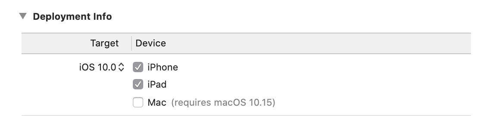

[](#facilitated-by-frontside)
[](https://travis-ci.org/Polidea/FlutterBleLib)
[](https://pub.dev/packages/flutter_ble_lib)


## FlutterBleLib

A library for all your Bluetooth Low Energy needs in Flutter. Internally utilises Polidea's
[MultiPlatformBleAdapter](https://github.com/Polidea/MultiPlatformBleAdapter),
which runs on [RxAndroidBle](https://github.com/Polidea/RxAndroidBle)
and [RxBluetoothKit](https://github.com/Polidea/RxBluetoothKit).

### BLE Simulator

This library supports [BLEmulator](https://github.com/Polidea/blemulator_flutter), the BLE simulator.
The simulation allows one to develop without physical smartphone or BLE peripheral and use one's production BLE–related code in automated testing.

## Installation

To use this plugin, add `flutter_ble_lib` as a [dependency in your pubspec.yaml file](https://pub.dev/packages/flutter_ble_lib/versions/2.1.0).

### Android

Set `minSDKVersion` in `[project]/android/app/build.gradle` file to 18.

```gradle
defaultConfig {
  ...
  // Set min SDK version to 18
  minSdkVersion 18
  targetSdkVersion 28
  ...
}
```

Add `tools:replace="android:label"` rule to `<application>` element in main `AndroidManifest.xml` file.

```xml
<application
  android:name="io.flutter.app.FlutterApplication"
  android:label="your_app"
  android:icon="@mipmap/ic_launcher"
  tools:replace="android:label">
  ...
</application>
```

Add `BLUETOOTH` and `ACCESS_FINE_LOCATION` permissions in main `AndroidManifest.xml` file.

```xml
<manifest xmlns:android="http://schemas.android.com/apk/res/android"
    xmlns:tools="http://schemas.android.com/tools"
    package="com.example.your_app">
  <uses-permission android:name="android.permission.BLUETOOTH"/>
  <uses-permission android:name="android.permission.ACCESS_FINE_LOCATION"/>
  ...
</manifest>
```

### iOS

In Xcode, set iOS Deployment Target (`IPHONEOS_DEPLOYMENT_TARGET`) to 10.0.



Add [Privacy - Bluetooth Always Usage Description](https://developer.apple.com/documentation/bundleresources/information_property_list/nsbluetoothalwaysusagedescription) key to `[project]/ios/Runner/Info.plist` file.

## Usage

The library is organised around a few base entities, which are:

- **BleManager**
- **Peripheral**
- **Service**
- **Characteristic**

You have to create an instance _BleManager_ and initialise underlying native resources.
Using that instance you then obtain an instance of _Peripheral_,
which can be used to run operations on the corresponding peripheral.

All operations passing the Dart-native bridge are asynchronous,
hence all operations in the plugin return either Future or Stream.

For more informations, see [REFERENCE](https://github.com/Polidea/FlutterBleLib/blob/master/REFERENCE.md).

**Notice:** this library will not handle any permissions for you. To be able to scan for peripherals on Android you need `ACCESS_FINE_LOCATION` [according to Android Developer Guide](https://developer.android.com/guide/topics/connectivity/bluetooth-le#permissions).

### Initialising

```dart
BleManager bleManager = BleManager();
await bleManager.createClient(); //ready to go!
// your peripheral logic
bleManager.destroyClient(); //remember to release native resources when you're done!
```

Following snippets assume the library has been initialised.

### Handling Bluetooth adapter state

```dart
enum BluetoothState {
  UNKNOWN,
  UNSUPPORTED,
  UNAUTHORIZED,
  POWERED_ON,
  POWERED_OFF,
  RESETTING,
}


bleManager.enableRadio(); //ANDROID-ONLY turns on BT. NOTE: doesn't check permissions
bleManager.disableRadio() //ANDROID-ONLY turns off BT. NOTE: doesn't check permissions
BluetoothState currentState = await bleManager.bluetoothState();
bleManager.observeBluetoothState().listen((btState) {
  print(btState);
  //do your BT logic, open different screen, etc.
});
```

### Scanning for peripherals

```dart
bleManager.startPeripheralScan(
  uuids: [
    "F000AA00-0451-4000-B000-000000000000",
  ],
).listen((scanResult) {
  //Scan one peripheral and stop scanning
  print("Scanned Peripheral ${scanResult.peripheral.name}, RSSI ${scanResult.rssi}");
  bleManager.stopPeripheralScan();
});
```

The snippet above starts peripheral scan and stops it after receiving first result.
It filters the scan results to those that advertise a service with specified UUID.

**NOTE:** `isConnectable` and `overflowServiceUuids` fields of `ScanResult` are iOS-only and remain `null` on Android.

### Connecting to peripheral

First you must obtain a _ScanResult_ from _BleManager.startPeripheralScan()_.

```dart
Peripheral peripheral = scanResult.peripheral;
peripheral.observeConnectionState(emitCurrentValue: true, completeOnDisconnect: true)
  .listen((connectionState) {
    print("Peripheral ${scanResult.peripheral.identifier} connection state is $connectionState");
  });
await peripheral.connect();
bool connected = await peripheral.isConnected();
await peripheral.disconnectOrCancelConnection();
```

The snippet above starts observing the state of the connection to the peripheral,
connects to it, checks if it's connected and then disconnects from it.

### Transactions

Methods that do not have counterpart with opposite effect and are asynchronous accept
`String transactionId` as an optional argument, to allow the user to cancel such an operation.
The Future returned to Dart will then finish with a _BleError(BleErrorCode.operationCancelled...)_,
**but this will only discard the result of the operation, the operation itself will be executed either way**.

For example, if I decided that I no longer want to run discovery on the selected peripheral:

```dart
//assuming peripheral is connected
peripheral.discoverAllServicesAndCharacteristics(transactionId: "discovery");
//will return operation cancelled error after calling the below
bleManager.cancelTransaction("discovery");
```

Each new operation with the same _transactionId_ will cause the previous one to be cancelled with error, if it hasn't finished yet.
If _transactionId_ is set to null or it isn't specified at all, the library sets unique integer _transactionId_ to such operation.

**NOTE:
Do not to set integers as _transactionId_ as they are used by the library.**

### Obtaining characteristics

To be able to operate on the peripheral, discovery of its services and characteristics must be run first.

```dart
//assuming peripheral is connected
await peripheral.discoverAllServicesAndCharacteristics();
List<Service> services = await peripheral.services(); //getting all services
List<Characteristic> characteristics1 = await peripheral.characteristics("F000AA00-0451-4000-B000-000000000000");
List<Characteristic> characteristics2 = await services.firstWhere(
  (service) => service.uuid == "F000AA00-0451-4000-B000-000000000000").characteristics();

//characteristics1 and characteristics2 have the same contents
```

Objects representing characteristics have a unique identifer, so they point to one specific characteristic,
even if there are multiple service/characteristic uuid matches.

### Manipulating characteristics

Below are 3 methods of writing to a characteristic, which all result in the same effect given
there's only one service with specified UUID and only one characteristic with specified UUID.

```dart
peripheral.writeCharacteristic(
  "F000AA00-0451-4000-B000-000000000000",
  "F000AA02-0451-4000-B000-000000000000",
  Uint8List.fromList([0]),
  false); //returns Characteristic to chain operations more easily

service.writeCharacteristic(
  "F000AA02-0451-4000-B000-000000000000",
  Uint8List.fromList([0]),
  false); //returns Characteristic to chain operations more easily

characteristic.write(Uint8List.fromList([0]), false); //returns void
```

Monitoring or reading a characteristic from _Peripheral_/_Service_ level
return _CharacteristicWithValue_ object, which is _Characteristic_ with additional `Uint8List value` property.

## Facilitated by Frontside

[Frontside](https://github.com/thefrontside) provided architectural advice and financial support for this library on behalf of [Resideo](https://github.com/resideo).

## Maintained by

This library is maintained by [Polidea](https://www.polidea.com/?utm_source=Github&utm_medium=Npaid&utm_campaign=Main&utm_term=Code&utm_content=GH_NOP_MPG_COD_FBLE001)

[Contact us](https://www.polidea.com/project/?utm_source=Github&utm_medium=Npaid&utm_campaign=Kontakt&utm_term=Code&utm_content=GH_NOP_KKT_COD_FBLE001)

[Learn more about Polidea's BLE services](https://www.polidea.com/services/ble/?utm_source=Github&utm_medium=Npaid&utm_campaign=Tech_BLE&utm_term=Code&utm_content=GH_NOP_BLE_COD_FBLE001).

#### Maintainers

TBD

## License

Copyright 2019 Polidea Sp. z o.o

Licensed under the Apache License, Version 2.0 (the "License");
you may not use this file except in compliance with the License.
You may obtain a copy of the License at

http://www.apache.org/licenses/LICENSE-2.0

Unless required by applicable law or agreed to in writing, software
distributed under the License is distributed on an "AS IS" BASIS,
WITHOUT WARRANTIES OR CONDITIONS OF ANY KIND, either express or implied.
See the License for the specific language governing permissions and
limitations under the License.

## More from Polidea

Check out other Polidea's BLE libraries:

- [react-native-ble-plx](https://github.com/Polidea/react-native-ble-plx)
- [RxAndroidBle](https://github.com/Polidea/RxAndroidBle)
- [RxBluetoothKit](https://github.com/Polidea/RxBluetoothKit)
